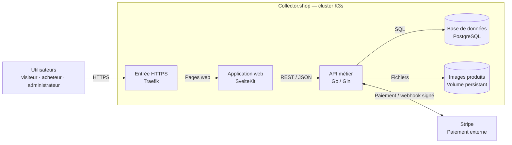
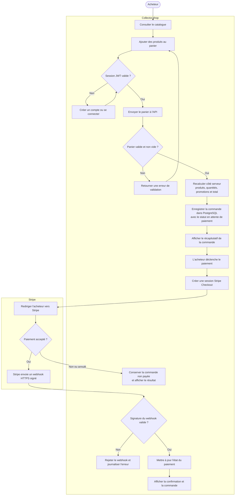

# Architecture technique sécurisée — modèle C4

## 1. Convention retenue

Le **modèle C4** est une convention de représentation des architectures logicielles fondée sur quatre niveaux : **Contexte**, **Conteneurs**, **Composants** et **Code**.

Le document utilise deux vues complémentaires : une vue statique **C4 Container simplifiée** pour les applications, les stockages et leurs liaisons indispensables, puis un **diagramme de flux** pour l'enchaînement du processus d'achat et de paiement. Dans C4, un « conteneur » désigne une application ou un stockage, pas nécessairement un conteneur Docker.

## 2. Vue statique — architecture des conteneurs

Cette première vue décrit les conteneurs déployés et leurs liaisons principales. Les éléments transverses, comme l'injection des secrets et le déploiement, sont volontairement exclus pour préserver la lisibilité.

### Lecture de la vue

- les trois profils utilisent le même point d'entrée HTTPS ;
- Traefik transmet les pages à l'application web ;
- l'application web appelle l'API métier ;
- seule l'API accède à PostgreSQL, aux images et à Stripe ;
- le webhook Stripe rejoint l'API en HTTPS par l'intermédiaire de Traefik.

Le processus de construction et de déploiement des conteneurs avec GitHub Actions et Argo CD est présenté séparément dans le document [Cycle de vie du développement — DevSecOps et CI/CD](./CYCLE_VIE_DEVELOPPEMENT_DEVSECOPS_CICD.md).

## 3. Vue dynamique — flux de commande et de paiement

Cette seconde vue montre l'enchaînement du principal processus métier. Elle complète la vue statique en précisant les décisions, les validations de sécurité et les échanges avec Stripe.

### Lecture du flux

- le navigateur accède à l'application par Traefik en HTTPS ;
- l'application web transmet les opérations métier à l'API REST ;
- l'API contrôle l'authentification, valide le panier et recalcule le montant avant toute écriture ;
- Stripe collecte les données bancaires hors de Collector.shop ;
- seul un webhook Stripe dont la signature est valide peut confirmer le paiement dans PostgreSQL.

## 4. Solutions techniques retenues

| Couche | Solution | Rôle et sécurité |
|---|---|---|
| Interface web | SvelteKit, TypeScript, rendu SSR, Node.js | Pages publiques et privées ; JWT conservé dans un cookie protégé |
| API | Go, framework Gin, API REST/JSON | Validation des requêtes, règles métier et contrôle des rôles |
| Authentification | JWT signé HMAC et bcrypt | Vérification de signature, expiration de 24 h et mots de passe hachés |
| Base de données | PostgreSQL 16 avec GORM | Données relationnelles et accès uniquement depuis l'API |
| Paiement | Stripe Checkout | Données bancaires hors du système ; vérification de la signature des webhooks |
| Communication externe | HTTPS via Traefik et certificats Let's Encrypt | Chiffrement entre le navigateur, l'API publique et Stripe |
| Communication interne | Services Kubernetes sur TCP ; REST/JSON entre SPA et API | Services non exposés directement, sauf routes déclarées dans l'Ingress |
| Fichiers | Volume persistant Kubernetes | Stockage des images avec contrôle du type et de la taille |
| Conteneurisation | Images Docker multi-stage exécutées sans privilèges | Réduction de la surface d'attaque |
| Orchestration | K3s, probes Kubernetes et HPA du front | Redémarrage, disponibilité et adaptation à la charge |
| Déploiement | GitHub Actions et Argo CD | Images testées/scannées et déploiement GitOps depuis les manifests versionnés |
| Secrets | Kubernetes Secrets et variables d'environnement | Aucun secret réel dans le dépôt Git |

## 5. Principaux contrôles de sécurité

- TLS pour tous les flux publics ;
- authentification obligatoire pour les commandes et l'administration ;
- contrôle du rôle administrateur dans l'API, pas uniquement dans l'interface ;
- recalcul des prix côté serveur avant enregistrement d'une commande ;
- validation des fichiers, identifiants, quantités, prix et URLs de retour ;
- vérification cryptographique des JWT et webhooks Stripe ;
- mots de passe hachés avec bcrypt et secrets injectés à l'exécution ;
- base PostgreSQL et volumes accessibles uniquement depuis les composants nécessaires.

## Référence

- [Modèle C4 — diagrammes et niveaux de représentation](https://c4model.com/diagrams)
