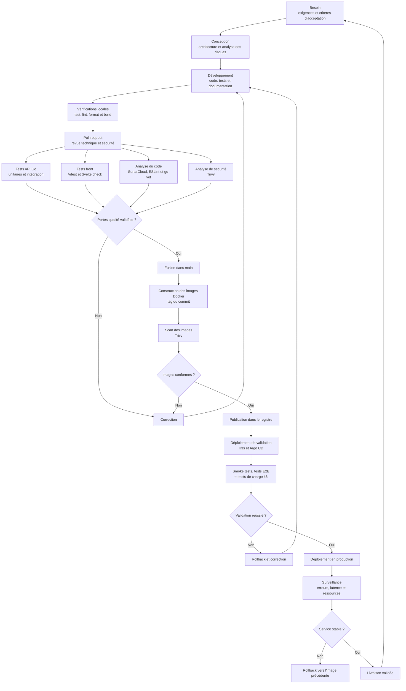

# Cycle de vie du développement DevSecOps et pipeline CI/CD

## 1. Étapes du cycle de vie

| Étape | Actions principales | Mesures de sécurité | Livrable |
|---|---|---|---|
| Besoin | Définir la fonctionnalité et ses critères d'acceptation | Identifier les données sensibles, les droits et les scénarios d'abus | Ticket prêt à développer |
| Conception | Définir les composants, flux, API et modèle de données | Appliquer le moindre privilège, prévoir la validation des entrées et le comportement en cas d'erreur | Schéma ou décision d'architecture |
| Développement | Écrire le code, les tests et la documentation | Ne pas stocker de secret ; contrôler les autorisations côté serveur ; utiliser les variables d'environnement | Branche de développement |
| Vérification locale | Exécuter tests, lint, formatage et compilation | Scanner les dépendances, secrets et erreurs de configuration | Code vérifié localement |
| Pull request | Faire relire la modification par un autre développeur | Vérifier les droits, entrées, journaux, dépendances et données exposées | Pull request approuvée |
| Intégration continue | Exécuter automatiquement les tests et analyses | SAST, analyse des dépendances, recherche de secrets et scan des images | Rapports CI et artefacts validés |
| Validation | Déployer dans un environnement proche de la production | Utiliser des données fictives ; tester les accès interdits et le rollback | Version candidate |
| Production | Déployer une image identifiée par le commit ou son digest | Injecter les secrets hors Git et conserver l'image précédente | Version publiée |
| Exploitation | Surveiller le service et traiter les incidents | Analyser les erreurs d'authentification, vulnérabilités et comportements anormaux | Mesures et tickets de correction |

## 2. Fonctionnement de la pipeline CI/CD

### 2.1 Déclenchement

| Événement | Pipeline exécutée |
|---|---|
| Pull request | Tests, lint, analyse SonarCloud, build et scans Trivy |
| Push sur `main` | Contrôles complets, construction et publication des images |
| Modification du manifeste GitOps | Déploiement par Argo CD |
| Lancement manuel | Tests de charge, validation ou redéploiement contrôlé |

### 2.2 Intégration continue

Les jobs indépendants sont exécutés en parallèle pour réduire le temps de retour.

| Job | Commandes ou outils | Résultat attendu |
|---|---|---|
| Tests API | `go test ./... -coverprofile=coverage.out` | Tous les tests passent et la couverture est produite |
| Qualité API | `gofmt`, `go vet` | Aucun problème de formatage ou d'analyse statique |
| Tests front | `npm test`, Vitest | Tous les tests passent |
| Vérification front | `npm run check`, Svelte check | Aucune erreur TypeScript ou Svelte |
| Qualité front | `npm run lint`, ESLint et Prettier | Aucun défaut bloquant |
| Analyse globale | SonarCloud | Quality Gate validé |
| Sécurité du dépôt | Trivy `vuln,secret,misconfig` | Aucun secret ni vulnérabilité interdite |
| Construction | Docker Buildx | Deux images reproductibles : API et SPA |
| Sécurité des images | Trivy image | Aucune vulnérabilité critique ou haute |

Si un job obligatoire échoue, la fusion est bloquée. Le développeur corrige le problème puis relance la pipeline.

### 2.3 Livraison continue

1. La branche principale validée déclenche la construction des images Docker.
2. Les images reçoivent un tag lié au SHA du commit.
3. Trivy analyse les dépendances système et applicatives des images.
4. Les images conformes sont publiées dans le registre Docker.
5. Le manifeste Kubernetes référence le tag ou le digest validé.
6. Argo CD synchronise le cluster K3s avec le manifeste Git.

### 2.4 Validation et production

| Contrôle | Outil | Critère d'acceptation |
|---|---|---|
| Démarrage des services | Probes Kubernetes | Tous les pods sont `Ready` |
| Parcours principaux | Smoke tests et tests E2E | Authentification, catalogue, panier et commande fonctionnels |
| Performance | k6 | p95 inférieur à 2,5 s et taux d'échec inférieur à 1 % |
| Montée en charge | HPA et `assert-scale-up.ps1` | Une nouvelle instance du front devient disponible |
| Sécurité | Tests d'accès et scan Trivy | Aucun accès interdit possible et aucun résultat bloquant |
| Retour arrière | Argo CD/Kubernetes | L'image précédente peut être restaurée |

## 3. Tests automatisés intégrés

| Type de test | Périmètre | Outil | Moment d'exécution |
|---|---|---|---|
| Unitaire | Fonctions, prix, promotions, JWT et validations | Go test, Vitest | À chaque pull request |
| Intégration | Contrôleurs, services, middleware et base de données | Go test | À chaque pull request |
| Sécurité | Authentification, autorisations, webhook et entrées invalides | Go test, SonarCloud, Trivy | À chaque pull request |
| E2E | Parcours utilisateur complets | Playwright ou outil équivalent | En environnement de validation |
| Performance | Latence, erreurs et capacité | k6 | Avant une livraison sensible |
| Déploiement | Démarrage, probes et montée en charge | Kubernetes, script PowerShell | Après déploiement de validation |

## 4. Portes de qualité

| Métrique | Critère d'acceptation | Outil de suivi |
|---|---|---|
| Couverture du nouveau code | Au moins 80 %, ou 90 % pour le code critique | Go coverage, Vitest coverage, SonarCloud |
| Complexité | Maximum 10 par fonction | SonarCloud |
| Duplication | Maximum 3 % sur le nouveau code | SonarCloud |
| Vulnérabilités | Aucune vulnérabilité critique ou haute | SonarCloud, Trivy |

La livraison est autorisée uniquement lorsque les tests, les quatre métriques qualité, les scans de sécurité et les contrôles de déploiement respectent leurs critères d'acceptation.
